# KumbaraKala

KumbaraKala is an Android application built for showcasing and managing pottery products digitally.  
The app allows users to browse products, generate story cards, upload images, and manage product information using Firebase and Cloudinary.

---

## Features

- User Authentication with Firebase
- Product Listing and Details
- Story Card Generation
- Cloudinary Image Upload
- Modern Jetpack Compose UI
- Firebase Firestore Integration

---

## Tech Stack

- Kotlin
- Jetpack Compose
- Firebase Authentication
- Firebase Firestore
- Cloudinary
- Coroutines
- Material Design 3

---

## Screenshots

### Splash Screen
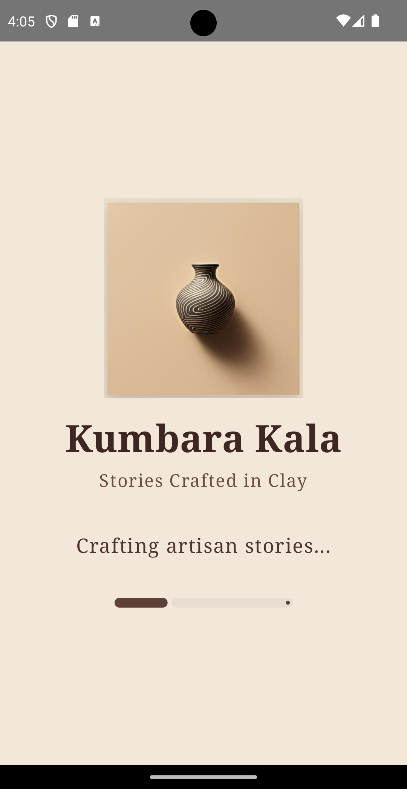

### Role Selection Screen
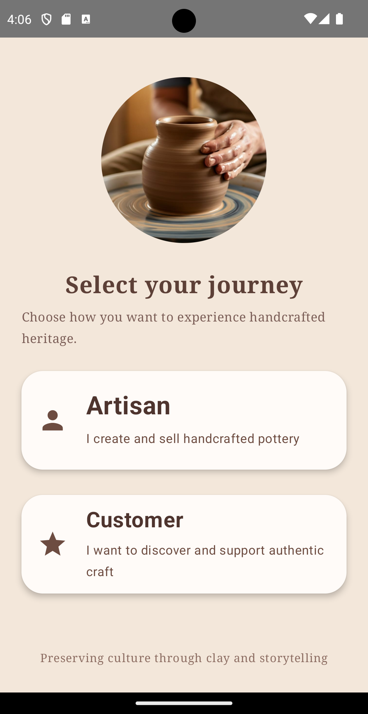

### User Catalog Screen 1
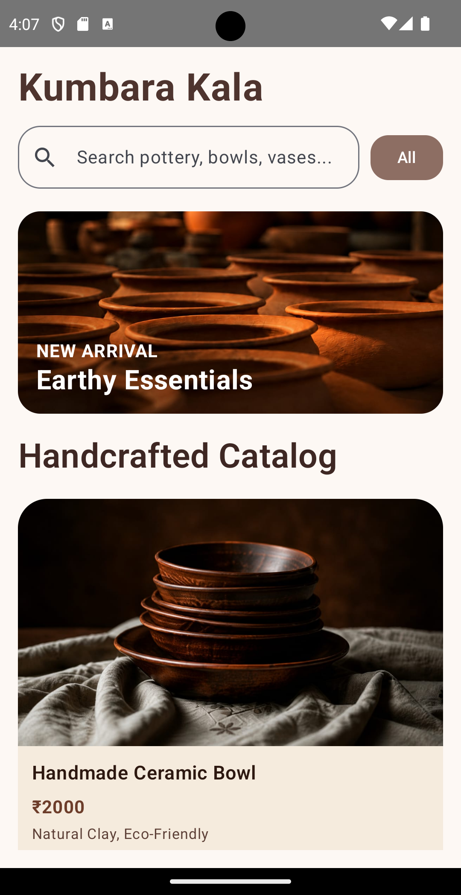

### User Catalog Screen 2
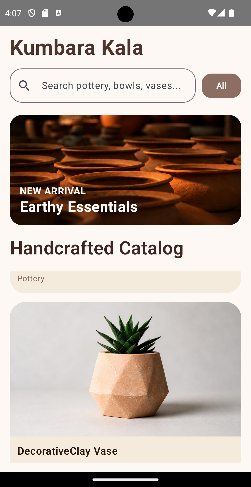

### Product Detail Screen 1
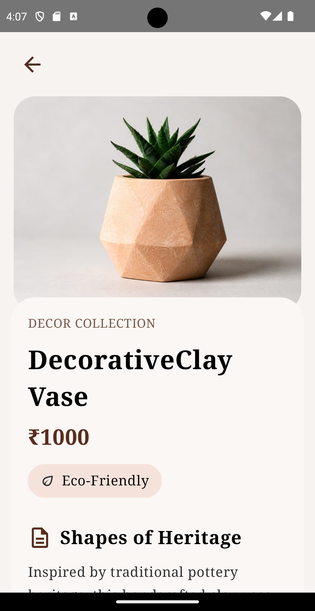

### Product Detail Screen 2
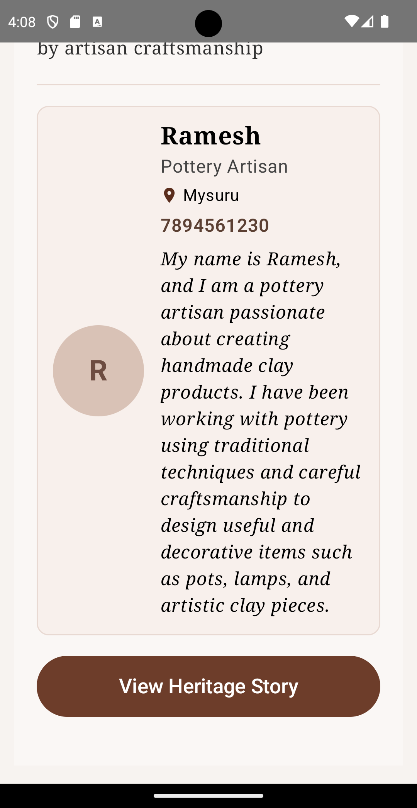

### Story Card Preview Screen 1
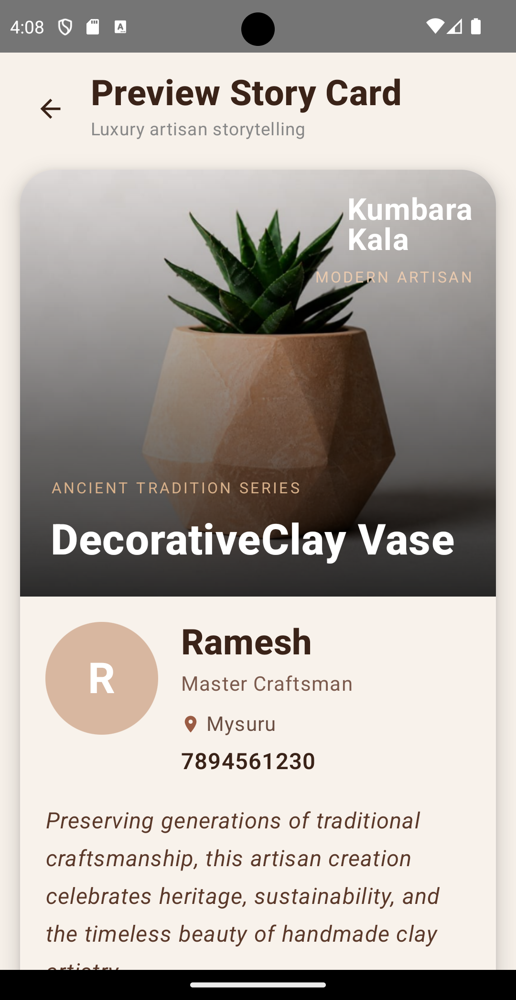

### Story Card Preview Screen 2
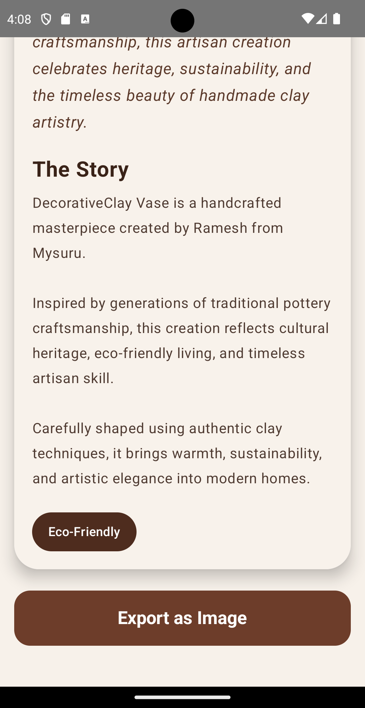

### Add Product Screen For Artisan 1
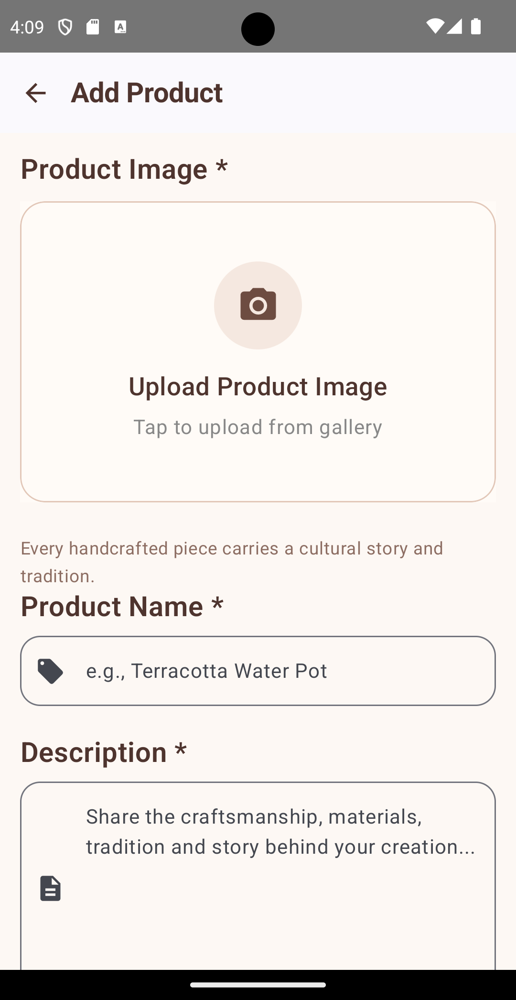

### Add Product Screen For Artisan 2
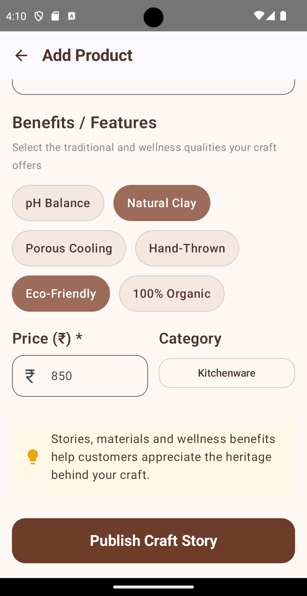

### Artisan Catalog Screen
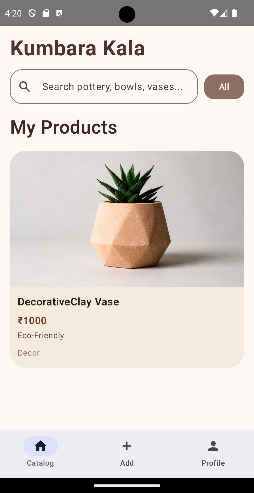

## Setup Instructions                    

1. Clone the repository
2. Open in Android Studio
3. Add your own `google-services.json`
4. Sync Gradle
5. Run the app

---

## Note

Sensitive configuration files such as `google-services.json` are excluded from the repository for security purposes.